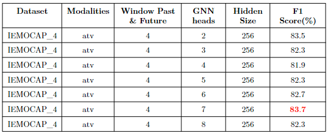

## About
This repo is about the reproduction of the result from paper: [**COGMEN: COntextualized GNN based Multimodal Emotion recognitioN**](https://arxiv.org/abs/2205.02455). The original repository contains source code of this paper is [here](https://github.com/Exploration-Lab/COGMEN).

## Requirements
- [Install PyTorch Geometric](https://pytorch-geometric.readthedocs.io/en/latest/notes/installation.html)

- [Install Comet.ml](https://www.comet.ml/docs/python-sdk/advanced/)
- [Install SBERT](https://www.sbert.net/)


## Preparing datasets for training
```
python preprocess.py --dataset="iemocap_4"
```

## Training networks
```
python train.py --dataset="iemocap_4" --modalities="atv" --from_begin --epochs=55
```

## Run Evaluation [](https://colab.research.google.com/drive/1biIvonBdJWo2TiYyTiQkxZ_V88JEXa_d?usp=sharing)
```
python eval.py --dataset="iemocap_4" --modalities="atv"
```

## Reproducted results
All the reproducted results are stored in [`results`](results). These results come from four experiments:
- *exp.1* **Hyperparameter settings**
  - Dataset: IEMOCAP (6-ways)

    

  - Dataset: IEMOCAP (4-ways)
  
    

- *exp.2* **The effect of the window length of related utterances**
  - Dataset: IEMOCAP (6-ways)
  
    

- *exp.3* **The effect of different combinations of modalities**
  
  

- *exp.4* **F1-score for each emotion label**
  - Dataset: IEMOCAP(6-ways)
  
    
    

  - Dataset: IEMOCAP(4-ways)
  
    
    
